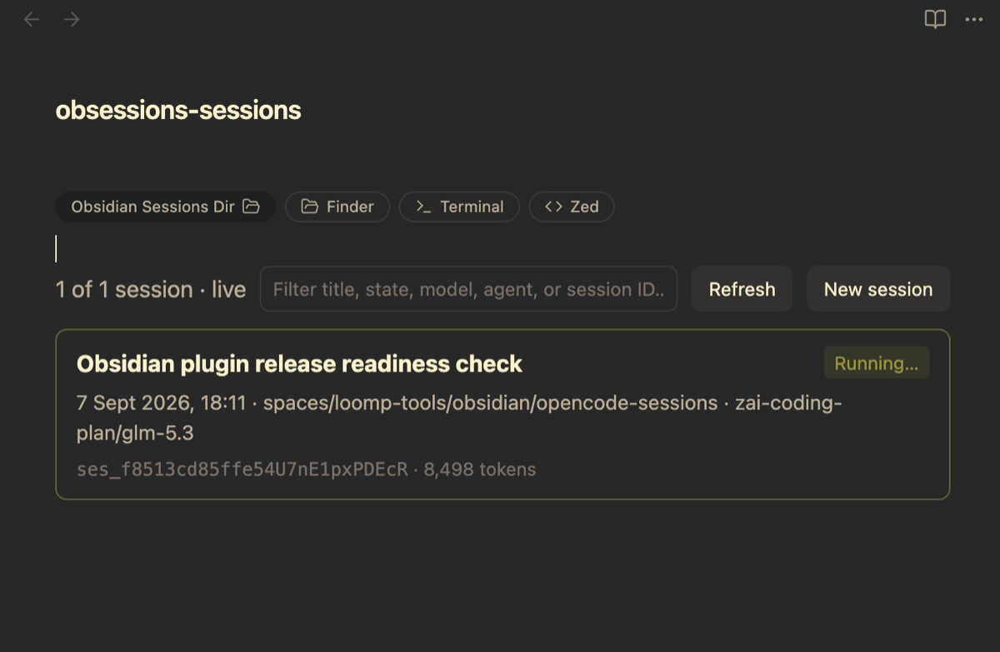
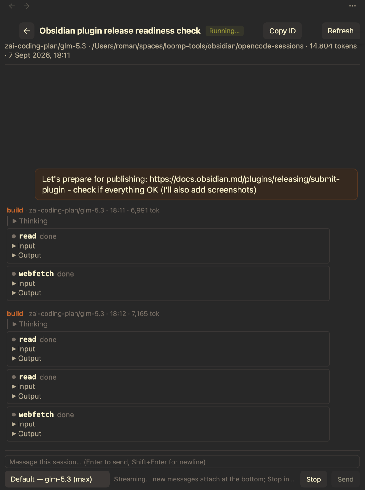
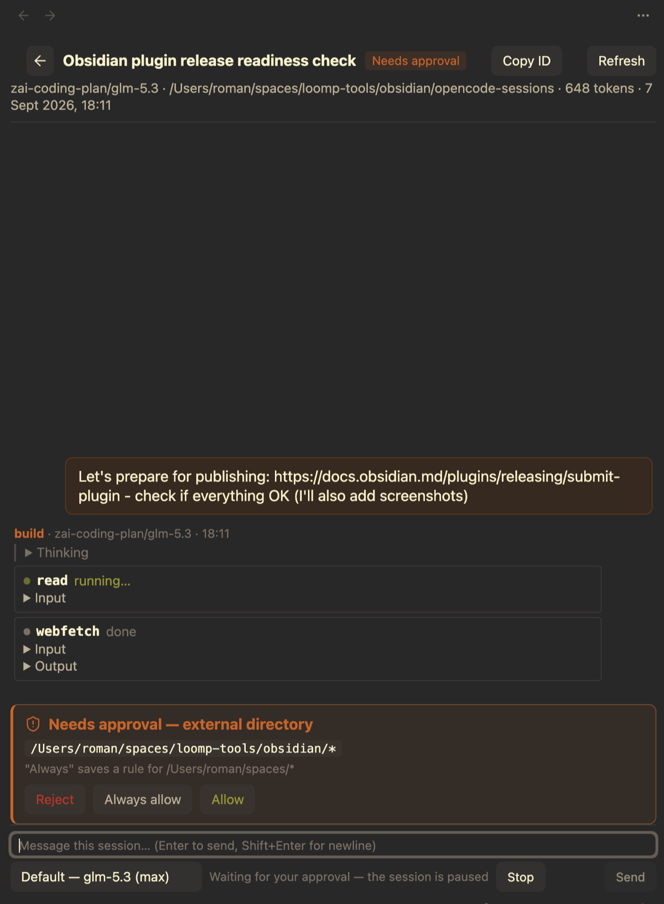
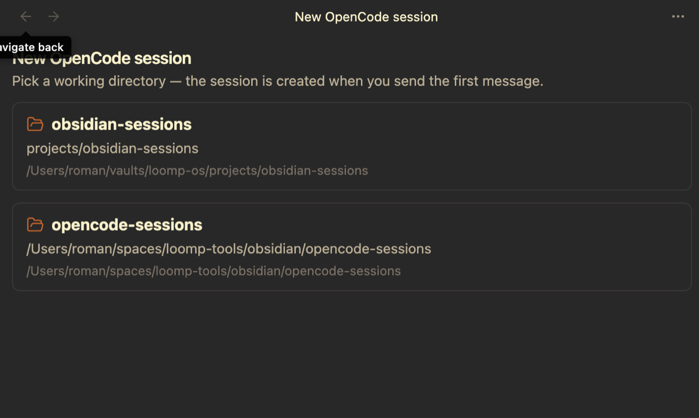

# Vibed (Obsidian plugin)

An agent-session browser for Obsidian. Browse your
[OpenCode](https://opencode.ai) **v2** sessions directly in
[Obsidian](https://obsidian.md) — as a dedicated view or as dashboards embedded
in any note — then open any session and watch it **stream in real time**, send
follow-up prompts, and interrupt runs.

Since v0.9 the plugin is **multi-backend**: alongside interactive OpenCode v2
connectors (local or remote), you can add read-only connectors for **OpenCode
v1**, **Claude Code**, **Codex CLI**, and **Cursor Agent** histories. OpenCode
v2 remains the first-class citizen; everything else is a read-only companion.




## Connectors

Connectors are named backend instances — add as many as you like in settings
(two remote OpenCode servers, three Codex installs, …). The first connector
is created for you: the local OpenCode v2 one (`opencode`, zero-config).

| kind | default name | source | mode |
| --- | --- | --- | --- |
| OpenCode v2 | `opencode`, `opencode-2`, … | `~/.local/share/opencode/opencode.db` + v2 server API | interactive: live SSE, prompt/stop, approvals, models, new sessions |
| OpenCode v1 | `opencode-v1`, … | legacy `session`/`message`/`part` tables in the same DB | read-only, historical |
| Claude Code | `claude`, `claude-2`, … | `~/.claude/projects/<slug>/<uuid>.jsonl` | read-only transcripts |
| Codex CLI | `codex`, `codex-2`, … | `~/.codex/sessions/**/rollout-*.jsonl` (+ `.zst` via zstd) | read-only transcripts |
| Cursor Agent | `cursor`, `cursor-2`, … | `~/.cursor/projects/*/agent-transcripts/<uuid>/*.jsonl` | read-only transcripts |

Names are editable and unique; a second connector of a kind auto-names
`<base>-2`, `-3`, … One connector is the **default** (used by dashboards and
chats that don't name one) — pick it in settings.

### OpenCode v2 connector modes

- **Local hybrid (default)**: SQLite `session_v2` listing (works when the
  server is down) + auto-discovered local server (`~/.local/state/opencode/
  service.json`) for live streaming and chat.
- **API-only**: untick *Use local database* — listing comes from
  `GET /api/session`.
- **Remote**: set a *Server URL override* (and password). The override is
  authoritative — no silent fallback to a local server. Pair with API-only
  listing, or point at a reachable DB path for hybrid mode.

### Backend caveats

| | titles | per-message time | tokens | cost | tool outputs |
| --- | --- | --- | --- | --- | --- |
| OpenCode v2/v1 | stored | ✓ | ✓ | ✓ | ✓ |
| Claude Code | `ai-title` | ✓ | summed on open (incl. cache) | ✖ | ✓ |
| Codex | first prompt | ✓ | cumulative totals | ✖ | ✓ (incl. apply_patch) |
| Cursor | first prompt | ✖ (file mtime only) | ✖ | ✖ | ✖ (never recorded) |

Claude/Cursor project folders encode the directory path lossily
(non-alphanumerics → `-`); configured *Directories* entries disambiguate.
Transcripts refresh on the plugin's interval; open chats poll every few
seconds. Very large transcripts (>128 MB) are refused with a clear message.

## Features

- **Note-embedded dashboards** via a `vibed` code block (cards or table layout) — no other plugins required.
- **Dedicated view** (command palette: *Open OpenCode sessions*, or the ribbon icon).
- **Live state tracking** from the v2 event stream (`GET /api/event`): Running…, Idle, Needs approval, Needs answer, Interrupted, Error — updated the instant they change. Falls back to SQLite heuristics when the server is unreachable.
- **Session chat view**: messages stream in live (text + reasoning + tool calls with input/output); history loads the newest page first and pages in older messages as you scroll to the top. Works for every connector (read-only ones simply don't stream).
- **Prompt & stop**: send messages to a session and interrupt a running one right from the composer (OpenCode v2 connectors).
- **New sessions**: the *New OpenCode session* command picks one of your configured directories and starts a draft chat; the server session is created with your first message.
- **Model selector**: defaults match OpenCode exactly — the last-used model *and* its persisted variant, falling back to the server's location-aware default; existing sessions switch live.
- **Agent selector**: pick the session's agent (e.g. `build`, `plan`, custom agents) next to the model selector; hidden and subagent-only entries are filtered out, descriptions show on hover, and existing sessions switch live (drafts apply the choice at creation).
- **Approvals**: permission banners with Allow / Always allow / Reject, synced with replies made anywhere (TUI, other tabs).
- **Agent questions**: answer the agent's `question` tool inline — options (single/multi-select), yes/no, or custom text — or dismiss it; synced with answers made anywhere. Works across both server generations (form and question APIs).
- **Offline fallback**: when the server is down, v2 chats show the conversation read-only from `session_v2`/`session_message`.
- **Session notes**: attach a markdown note to any session (every connector) — a side panel in the chat view with autosave, backed by a normal vault file found by `session:` frontmatter, not filename. See [Session notes](#session-notes).
- **Session tags**: note tags (Obsidian semantics — frontmatter `tags:` + inline `#tags`) become session tags — editable in the notes panel, shown on cards, filterable (`#tag` in the filter, an advanced filter popover, and a `tags:` widget option). See [Session tags & filtering](#session-tags--filtering).
- Also exposes an API (`globalThis.vibed`) for e.g. Datacore JSX consumers.

## Screenshots

**Live chat with streaming** — messages, reasoning, and tool calls appear as
they happen; the composer can send follow-ups or stop a running turn:



**Approvals in-app** — permission requests show up as a banner; allow, always
allow, or reject without leaving the note:



**New sessions** — pick one of your configured directories; the server session
is created with your first message:



## Embed in a note

A `vibed` code block renders a dashboard inside any note. The config is
simple `key: value` lines (or a JSON object).

**Session list** — a directory dashboard, one card per session:

````markdown
```vibed
connector: claude
layout: cards
basedir: ~/
dirs:
  - projects/my-project
```
````

**Single session** — pin one session id and the block renders a clean
widget: just the card, no toolbar (ideal for a project status note):

````markdown
```vibed
sessions:
  - ses_abc123def456
```
````

A missing id renders as a dashed "(not found)" card rather than an error.

Options (simple `key: value` lines or a JSON object):

| Option | Default | Description |
| --- | --- | --- |
| `connector` | default connector | Connector **name** (e.g. `claude`, `codex-2`). Unknown names render an inline error. |
| `dirs` | connector setting | Directories to list sessions for. Relative entries resolve against `basedir`. On OpenCode connectors this **overrides** the connector's configured directories; on Claude/Codex/Cursor it **adds to** them (a filter). |
| `sessions` | – | Explicit session ids (list). With **only** `sessions` the block renders a clean widget: just the cards, no toolbar. Missing ids render as dashed "(not found)" cards. |
| `basedir` | – | Prefix for relative `dirs`; cards/tables show directories relative to it. |
| `tags` | – | Only sessions whose note carries **all** of these tags (list or comma string; intersected with `dirs`). |
| `layout` | `cards` | `cards` or `table`. |
| `pageSize` | plugin setting | Sessions per page. |
| `title` | – | Optional heading above the dashboard. |

Click a card (or table row) to open the live chat view; click a session ID to copy it. Sessions with an attached note show a sticky-note button on their card / title cell — click it to open the note file. Tagged sessions show tag chips next to the session ID — click one to filter by it.

## Linking to sessions

Markdown links open the chat tab for a session:

```markdown
[Yesterday's refactor](obsidian://vibed?sessionId=ses_abc123)
[A claude session](obsidian://vibed?connector=claude&sessionId=<uuid>)
```

`opencode-v1:<id>`-style prefixed ids also work in *Open session by ID* (and
in `api.open("claude:<uuid>")`). Bare ids resolve against the default
connector.

## Session notes

Every session chat has a notes toggle (the sticky-note button in the header).
It opens a side panel next to the transcript: click **Create note** and type —
edits autosave (600 ms debounce); *Open in editor* hands the note to the
normal markdown editor. Notes work for **all** connectors, including the
read-only ones.

Notes are ordinary vault files. The attachment is a frontmatter id — never
the filename — so you can rename or move them anywhere in the vault and they
stay attached (the plugin looks them up through Obsidian's metadata cache):

```markdown
---
session: ses_abc123def456
connector: opencode
title: "Refactor the export pipeline"
created: 2026-09-09T12:00:00.000Z
---

Context, decisions, follow-ups…
```

By default notes are created in `vibed-notes/` at the vault root as
`<session-id>-<title>.md` — change the folder in **Settings → General →
Session notes folder**. The panel hides the frontmatter (but preserves it and
any properties you add on save). Editing the note elsewhere syncs back into
an open panel; a note whose `session:` frontmatter you remove simply reads as
*not attached*.

Back in the session list, cards and table rows of noted sessions get a
sticky-note button that opens the note file directly — it appears and
disappears live as notes are created, renamed, or detached.

## Session tags & filtering

A session's tags are its note's tags, with **full Obsidian semantics** —
the frontmatter `tags:` property plus inline `#tags` in the body, exactly
what the tag pane and `tag:` search see. Tag a session from the notes
panel (chips row above the editor: `+` to add, `×` to remove — inline
body tags are marked read-only, edit the body for those) or from the
note's properties in the normal editor.

Tags surface in the lists:

- **Cards & tables** show tag chips next to the session ID — click a chip
  to filter by that tag.
- **The filter input** is a small query language — prefixes make each
  criterion explicit, everything ANDs together:
  `#tag` (session tags), `is:<state>` (`is:running`, `is:idle`, …),
  `dir:<path>` and `model:<name>` (substrings; quote values with spaces,
  e.g. `model:"Sonnet 4.5"`), and free text (matches the session title).
  Example: `#urgent is:running model:"Sonnet 4.5" deploy`.
- **The funnel button** next to the input opens an advanced filter
  popover — per-criteria chips for Tags, State, Model, and Directory with
  live counts. It edits the same query string, so what you see in the
  input is always the truth.
- **Widgets** accept a `tags:` option (list or comma string); only
  sessions carrying **all** of the tags are listed, intersected with
  `dirs`:

  ````markdown
  ```vibed
  connector: opencode
  dirs:
    - projects/my-project
  tags:
    - urgent
  ```
  ````

`globalThis.vibed.notes.tags("<sessionId>")` returns a session's tags as
`[{tag, frontmatter, inline}]`.

## Settings

**General** — default connector, items per page, refresh interval (seconds;
`0` disables the timer), session notes folder (default `vibed-notes`).

**Connectors** — one card per connector: editable name, enable toggle,
health status, duplicate/delete, and per-kind fields:

- *OpenCode v2*: server URL override (empty = auto-discover), password,
  *Use local database* toggle, DB path, sqlite3 executable, directories,
  custom SQL (`WHERE` fragment — qualify columns like `session_v2.title`
  when the listing join makes bare names ambiguous).
- *OpenCode v1*: DB path, sqlite3, directories, custom SQL.
- *Claude Code / Cursor*: projects root, directories filter.
- *Codex*: sessions root, zstd executable, directories filter.

## Privacy & data access

Vibed runs entirely on your machine and contains **no telemetry**. For
transparency, it does access:

- **Files outside your vaults** (read-only): OpenCode v2/v1
  `~/.local/share/opencode/opencode.db`, Claude Code `~/.claude/projects/`,
  Codex `~/.codex/sessions/`, Cursor `~/.cursor/projects/` — that's where the
  agent histories live. Nothing outside your vault is modified. The only
  thing written anywhere: session notes you explicitly create, inside your
  vault (see [Session notes](#session-notes)).
- **Local network**: the auto-discovered OpenCode v2 server
  (`~/.local/state/opencode/service.json`) for live streaming, chat, prompts,
  and approvals. With a remote *Server URL override*, the plugin talks to that
  host only — and nothing else.
- **Helper binaries**: the system `sqlite3` binary (path configurable) and an
  optional `zstd` for Codex transcripts are spawned locally, detached.
- **System clipboard** (write-only): used solely when you explicitly copy a
  session ID (clicking the ID on a card, or the *Copy ID* button in a chat).
  The clipboard is never read.

The file reads and helper binaries above are the entire reason the plugin
uses Node's `fs` and `child_process` (and therefore is desktop-only) — no
other files are touched and no other commands are run.

## Install (manual)

Copy `main.js`, `manifest.json`, and `styles.css` into
`<vault>/.obsidian/plugins/vibed/`, then enable **Vibed** under
Settings → Community plugins. Desktop only (spawns `sqlite3`/`zstd`, talks to
local servers).

## API

`globalThis.vibed` (version 4):

```js
const api = globalThis.vibed;
api.connectors();                    // [{ id, name, kind, enabled, capabilities }]
api.defaultConnector();              // name of the default connector
const claude = api.connector("claude");
const rows = await claude.list({ dirs: ["/abs/path"] });
await claude.messages("<uuid>", { limit: 100, order: "asc" });
const unsubscribe = api.subscribe(() => {});
api.config();
api.notes.find("ses_…");             // { path, basename } | null — note attached by frontmatter
api.notes.folder();                  // configured notes folder ("vibed-notes")
api.notes.tags("ses_…");             // [{tag, frontmatter, inline}] — Obsidian-semantics tags
api.open("claude:<uuid>");           // also "ses_…" (default connector)
await api.server.health();           // v2-only namespace
await api.server.messages("ses_…", { limit: 100, order: "asc" });
await api.server.prompt("ses_…", "fix the failing test");
await api.server.stop("ses_…");
```

Rows come pre-formatted: `titleLabel`, `stateLabel`, `updatedLabel`,
`modelLabel`, `directoryLabel`, `tokensLabel`, plus `connectorId`,
`connectorName`, `source` (kind), `readOnly`, and raw backend fields.

## How state detection works

**OpenCode v2 (primary)**: one SSE connection per v2 connector maps
`session.execution.*` → Running…/Idle/Interrupted/Error and
`permission.asked` → Needs approval. **Fallback** (server unreachable): a
session is Running when its latest assistant message has no `time.completed`
yet, or the newest message is still the user's — within a 15-minute
freshness window.

**Read-only backends**: freshness heuristics — a transcript whose last line
suggests an open turn (Claude: last line is the user prompt; Codex: last
event is `task_started`; Cursor: last line is an assistant message without
`turn_ended`) reads as Running within the same 15-minute window; otherwise
Idle. OpenCode v1 uses the message-table variant of the v2 fallback.

## Contact

- Telegram: [@romanexe](https://t.me/romanexe) · [@romanexeru](https://t.me/romanexeru)
- X: [@exemplarov](https://x.com/exemplarov)

## Development

Plain single-file plugin, no build step (`main.js` is hand-written ES2022).
`node --check main.js` to syntax-check. Design docs live in `spec/`.
Excluded from the repo: `data.json` (local settings) and `.hotreload` (dev
marker).
